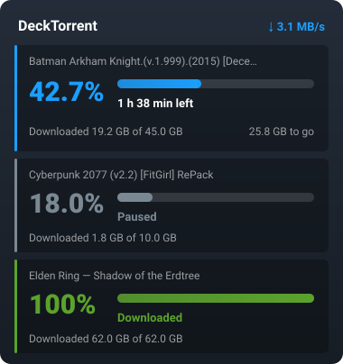

<div align="center">


# DeckTorrent

**Torrents on the Steam Deck, done properly.**
A background Transmission daemon instead of a desktop window, control from Game Mode,
big numbers instead of small print.

[Русский](README.md) · **English**




</div>

---

## Install — one command

```bash
git clone https://github.com/<you>/DeckTorrent ~/Documents/DeckTorrent
~/Documents/DeckTorrent/install.sh
```

You are asked for the sudo password once — only to put the plugin into Decky's directory
(owned by root) and the sleep hook into `/etc`. Everything else lives in your home directory.
The installer is idempotent: running it again repairs whatever drifted and breaks nothing.

<details>
<summary>What it actually does</summary>

1. unpacks Transmission 4.0.6 into `~/.local/opt/transmission` — outside `/usr`, which SteamOS overwrites on every update;
2. configures `settings.json`: RPC on localhost only, watch directory, no seeding after completion;
3. starts the user service and enables `linger`, so downloads survive switching modes;
4. installs desktop entries with an icon and registers itself for `.torrent` files and `magnet:` links;
5. builds and installs the Decky plugin;
6. installs the sleep hook: pause before suspend, resume after;
7. verifies that RPC responds.

Flags: `--uninstall`, `--no-plugin`, `--no-sleep-hook`, `--force-binaries`.
Directories are overridable: `DECKTORRENT_DOWNLOADS=/run/media/mmcblk0p1/games ./install.sh`.

</details>

---

## Usage

| Where | What |
|---|---|
| **Game Mode** | “⋯” → Decky → **DeckTorrent**. **A** — pause/resume, **Y** — menu: verify files, find sources, delete |
| **Desktop** | the **DeckTorrent** shortcut — the daemon's web UI at `localhost:9091` |
| **magnet link** | opening one hands it straight to the daemon, no windows appear |
| **.torrent file** | double-click it, or drop it into `~/Torrents` |
| **Downloads** | `~/Downloads` |

The plugin switches between Russian and English automatically, following the system language.

---

## What you see

The panel answers the two questions people actually ask: **how much is downloaded**
and **when will it be done**.

- **42.7%** in a large figure, coloured by state;
- **“1 h 38 min left”** right under the bar; “Paused” when stopped, “Downloaded” when finished;
- **“Downloaded 19.2 GB of 45.0 GB · 25.8 GB to go”** in small grey type;
- the torrent name is a caption on top, not the main character.

Peers, share ratio and status codes are out of sight — they live in the **Y** menu.
The bar tracks whatever is really happening: downloading, hash checking, or fetching
magnet metadata.

---

## Sane defaults, already applied

**No seeding after completion** (`ratio-limit: 0`). A finished torrent goes to “Downloaded”,
uploading stops and **files are released**: while the daemon holds file descriptors, deleting
files does not give the disk space back.

**Downloads survive the Desktop ⇄ Game Mode switch.** Only the background daemon downloads,
never an application window; `linger` keeps systemd from killing it with the session.

**RPC listens on localhost only** — nothing is exposed, no password needed.

---

## Layout

| Part | What it does |
|---|---|
| `install.sh` | install and uninstall in one command |
| `plugin/` | the Decky plugin: `@decky/api` + `@decky/ui`, rollup build, ru/en localisation |
| `scripts/torrent-add.sh` | handler for `.torrent` and `magnet:` — adds straight to the daemon |
| `scripts/transmission-daemon.sh` | start the background daemon |
| `scripts/transmission-gui.sh` | open the daemon's web UI |
| `scripts/transmission-sleep-hook.sh` | pause before suspend, resume after |
| `scripts/selftest.sh` | diagnostics: daemon, RPC, associations, plugin, Decky ports |
| `scripts/deploy.sh` | reinstall just the plugin while developing |
| `docs/` | how the daemon is set up and how to develop the plugin (in Russian) |

---

## Diagnostics

```bash
~/Documents/DeckTorrent/scripts/selftest.sh   # read-only, no sudo needed
```

<details>
<summary>The plugin is nowhere to be seen</summary>

It exists **only in Game Mode**: the “⋯” button → Decky panel. Desktop Mode has no such panel.

```bash
tail ~/homebrew/logs/DeckTorrent/*.log     # “DeckTorrent запущен” = backend is alive
sudo journalctl -u plugin_loader -n 50     # what the loader said
```

</details>

<details>
<summary>Downloads stop when switching to Game Mode</summary>

The daemon is dying with the session:

```bash
sudo loginctl enable-linger $USER
systemctl --user restart transmission-daemon
```

</details>

---

## Development

```bash
cd plugin && npm ci && npm run build
sudo ../scripts/deploy.sh          # install the plugin only
```

More detail in [`docs/decky-plugin-dev.md`](docs/decky-plugin-dev.md) and
[`docs/transmission-setup.md`](docs/transmission-setup.md) (Russian).

---

## Roadmap

- [x] One installer instead of manual steps
- [x] Uninstaller
- [x] Russian and English interface
- [ ] Web UI shortcut in the Steam library
- [ ] Wrappers for the remaining binaries (`transmission-create`, `-show`, `-cli`, `-edit`)
- [ ] Disk-full protection

---

<div align="center">

MIT · Built and tested on a Steam Deck running SteamOS (holo)

</div>
