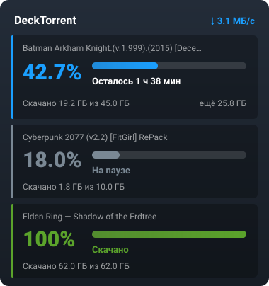

<div align="center">


# DeckTorrent

**Торренты на Steam Deck по-человечески.**
Фоновый демон Transmission вместо десктопного окна, управление прямо из игрового режима,
крупные цифры вместо мелких деталей.

[English](README.md) · **Русский**




</div>

---

## Установка — одна команда

```bash
git clone https://github.com/locoholy/DeckTorrent ~/Documents/DeckTorrent
~/Documents/DeckTorrent/install.sh
```

Пароль sudo спросят один раз — только чтобы положить плагин в каталог Decky
(он принадлежит root) и хук сна в `/etc`. Всё остальное живёт в домашнем каталоге.
Установщик идемпотентный: повторный запуск чинит разъехавшееся и ничего не ломает.

<details>
<summary>Что именно он делает</summary>

1. распаковывает Transmission 4.0.6 в `~/.local/opt/transmission` — вне `/usr`, который SteamOS перезаписывает при обновлении;
2. настраивает `settings.json`: RPC только на localhost, папка слежения, без раздачи после закачки;
3. поднимает пользовательский сервис и включает `linger`, чтобы закачки жили между режимами;
4. ставит ярлыки с иконкой и делает себя обработчиком `.torrent` и `magnet:`;
5. собирает и устанавливает плагин Decky;
6. ставит хук сна: пауза перед сном, продолжение после;
7. проверяет, что RPC отвечает.

Ключи: `--uninstall`, `--no-plugin`, `--no-sleep-hook`, `--force-binaries`.
Каталоги переопределяются переменными: `DECKTORRENT_DOWNLOADS=/run/media/mmcblk0p1/games ./install.sh`.

</details>

---

## Как пользоваться

| Где | Что |
|---|---|
| **Игровой режим** | «⋯» → Decky → **DeckTorrent**. **A** — пауза/продолжить, **Y** — меню: проверить файлы, найти источники, удалить |
| **Десктоп** | ярлык **DeckTorrent** — веб-интерфейс демона на `localhost:9091` |
| **magnet-ссылка** | открывается — сразу уходит в демон, окон не появляется |
| **Файл .torrent** | двойной клик или положить в `~/Torrents` |
| **Загрузки** | `~/Downloads` |

Интерфейс плагина сам переключается между русским и английским по языку системы.

---

## Что на экране

Панель отвечает на два вопроса, которые задают на самом деле: **сколько уже скачано**
и **когда будет готово**.

- **42.7%** — крупной цифрой цвета состояния;
- **«Осталось 1 ч 38 мин»** — прямо под полосой; на паузе там «На паузе», в конце — «Скачано»;
- **«Скачано 19.2 ГБ из 45.0 ГБ · ещё 25.8 ГБ»** — мелким серым;
- имя торрента — подпись сверху, а не главный герой.

Пиры, рейтинг раздачи и коды состояний убраны с глаз — они в меню по кнопке **Y**.
Полоса показывает то, что реально происходит: скачивание, проверку хеша или сбор
метаданных магнета.

---

## Почему DeckTorrent, а не обычный qBittorrent из Discover?

| Возможность | Обычный qBittorrent / KTorrent (Flatpak) | DeckTorrent |
|---|---|---|
| **Переключение Desktop ⇄ Game Mode** | ❌ Закачки зависают или падают при смене сессии | ✅ **Непрерывно:** фоновый сервис systemd с `linger` качает независимо от режима |
| **Управление в игровом режиме** | ❌ Кривое окно десктопного приложения со стиков | ✅ **Нативная панель Decky:** крупный текст, удобное управление геймпадом (кнопки A / Y) |
| **Сон консоли (Sleep / Resume)** | ❌ Риск повреждения недокачанных файлов при засыпании | ✅ **Хуки сна:** автоматическая пауза перед сном и безопасное возобновление после сети |
| **Потребление ОЗУ** | ❌ Тяжелый GUI-клиент отъедает оперативку во время игр | ✅ **Headless-демон:** легковесный Transmission 4.0.6 ест всего ~30 МБ памяти |
| **Клик по magnet-ссылкам** | ❌ Ручное копирование и открывание окон | ✅ **Системные ассоциации:** ссылки из браузера сразу улетают в фоновый демон |

---

## Что настроено за вас

**Не раздаёт после закачки** (`ratio-limit: 0`). Торрент переходит в «Скачано», отдача
прекращается и **файлы освобождаются**: пока демон держит дескрипторы, удалённые файлы
не возвращают место на диске.

**Закачки переживают переход между режимами.** Качает только фоновый демон, а не окно
приложения; `linger` не даёт systemd убить его вместе с сессией.

**RPC слушает только localhost** — наружу ничего не торчит, пароль не нужен.

---

## Из чего состоит

| Часть | Что делает |
|---|---|
| `install.sh` | установка и удаление одной командой |
| `plugin/` | плагин Decky: `@decky/api` + `@decky/ui`, сборка rollup, локализация ru/en |
| `scripts/torrent-add.sh` | обработчик `.torrent` и `magnet:` — добавляет прямо в демон |
| `scripts/transmission-daemon.sh` | запуск фонового демона |
| `scripts/transmission-gui.sh` | открыть веб-интерфейс демона |
| `scripts/transmission-sleep-hook.sh` | пауза закачек перед сном, продолжение после |
| `scripts/selftest.sh` | диагностика: демон, RPC, ассоциации, плагин, порты Decky |
| `scripts/deploy.sh` | переустановка только плагина при разработке |
| `docs/` | как устроен демон и как разрабатывать плагин |

---

## Диагностика

```bash
~/Documents/DeckTorrent/scripts/selftest.sh   # ничего не меняет, sudo не нужен
```

<details>
<summary>Плагина не видно</summary>

Он существует **только в игровом режиме**: кнопка «⋯» → панель Decky. В Desktop Mode
его нет и быть не может.

```bash
tail ~/homebrew/logs/DeckTorrent/*.log     # «DeckTorrent запущен» = бэкенд жив
sudo journalctl -u plugin_loader -n 50     # что сказал загрузчик
```

</details>

<details>
<summary>Закачки встают при переходе в игровой режим</summary>

Значит демон умирает вместе с сессией:

```bash
sudo loginctl enable-linger $USER
systemctl --user restart transmission-daemon
```

</details>

История изменений — в [CHANGELOG.md](CHANGELOG.md).

---

## Разработка

```bash
cd plugin && npm ci && npm run build
sudo ../scripts/deploy.sh          # поставить только плагин
```

Подробности — в [`docs/decky-plugin-dev.md`](docs/decky-plugin-dev.md) и
[`docs/transmission-setup.md`](docs/transmission-setup.md).

---

## Дальше

- [x] Один установщик вместо ручных шагов
- [x] Деинсталлятор
- [x] Русский и английский интерфейс
- [ ] Ярлык веб-морды в библиотеке Steam
- [ ] Обёртки для остальных бинарников (`transmission-create`, `-show`, `-cli`, `-edit`)
- [ ] Защита от переполнения диска

---

<div align="center">

MIT · Собрано и проверено на Steam Deck, SteamOS (holo)

</div>
